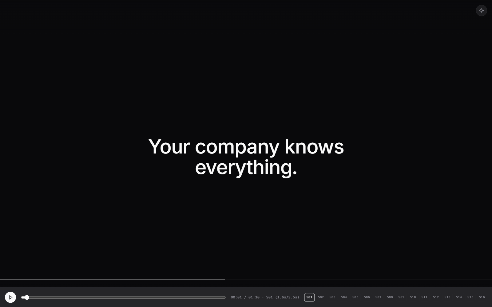
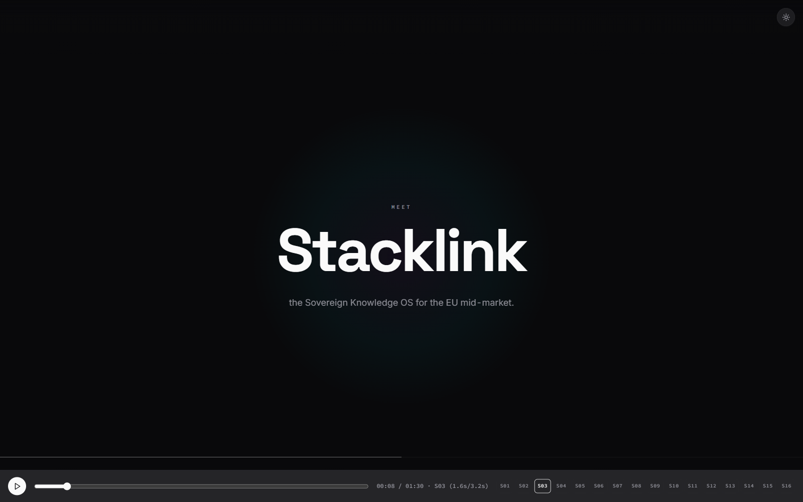
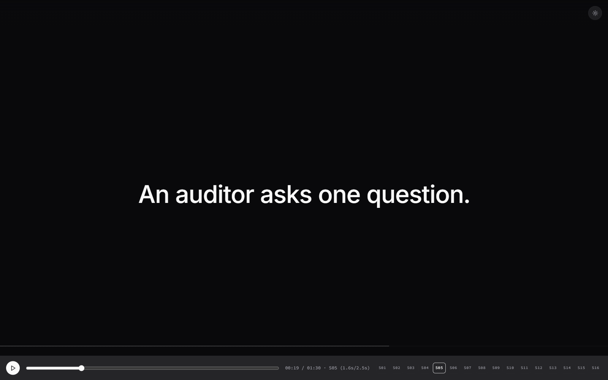
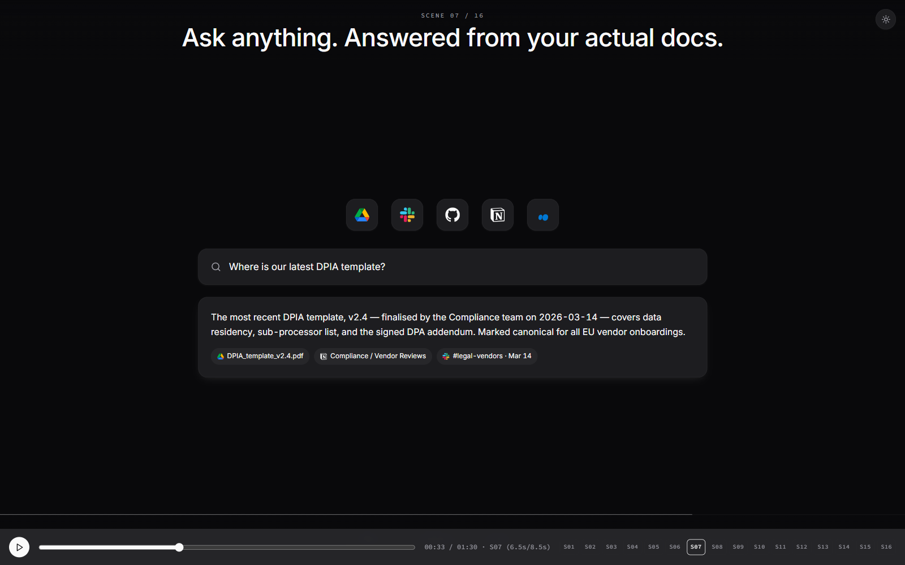
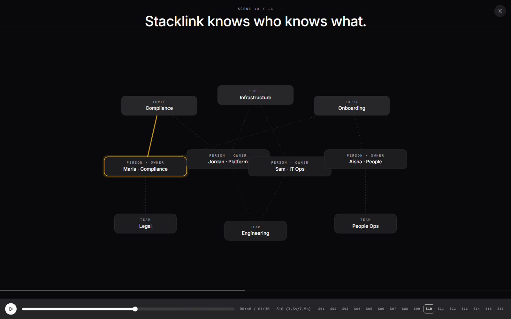
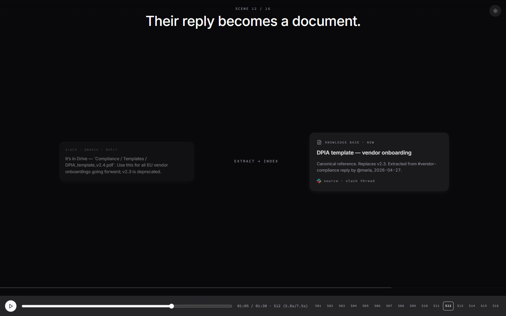
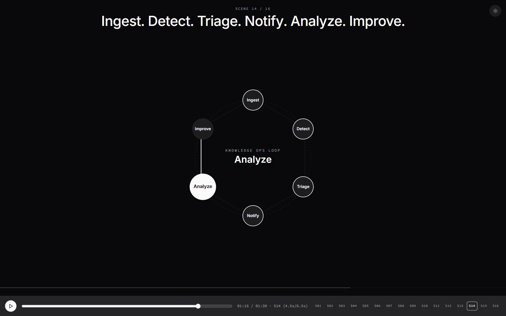
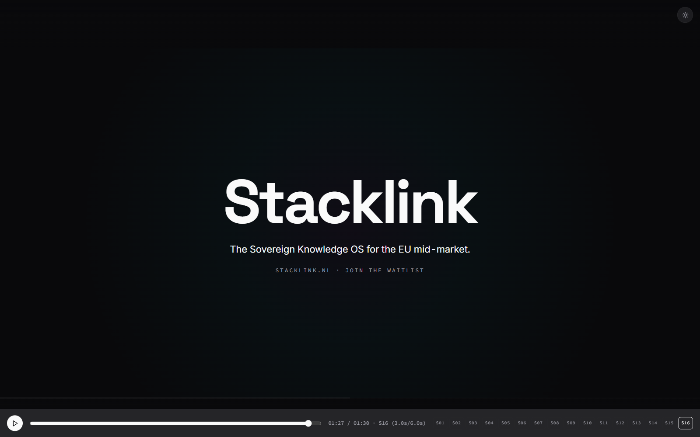

# Cinemorph

> Generate cinematic launch-video-style React presentations with shared-layout (FLIP) morph transitions. From a brief to a working deck — or a 30-second product film with audio — in one command.

A Claude Code plugin that turns a written brief into a production-ready Vite + React + Framer Motion deck where elements morph cleanly between stages. Output it as a live deck, a PPTX with native PowerPoint Morph transitions, or a Playwright-recorded MP4. Cinematic launch-video lessons are baked in so the audio bus, scene-transition SFX placement, autoplay gate, and dev scrubber all work the first time.

---

## What it produces

**A 30-second cinematic launch video** (audio bed + voiceover + SFX cues + dev scrubber):

[](assets/demos/launch-video.mp4)

> Click the image to watch the full 30-second MP4 (14 MB). Frame-by-frame stills are below.

| `00:00` | `00:04` | `00:08` |
|:---:|:---:|:---:|
|  |  |  |
| Hero — logo pop | Search hyper-zoom + typing | Wide reveal, sources at corners |

| `00:11` | `00:16` | `00:20` |
|:---:|:---:|:---:|
|  |  |  |
| Cylinder substrate, sources orbit | Onboarding click + agent log | 3D agent constellation bloom |

| `00:23` | `00:27` |
|:---:|:---:|
|  |  |
| Compliance pills sweep | Outro logo + URL chime |

**A 5-slide investor pitch deck** with FLIP morph transitions (live React, also exports to PPTX with Morph):

| 1. Hook | 2. Problem | 3. Solution |
|:---:|:---:|:---:|
|  |  |  |

| 4. Differentiation | 5. Team & Ask |
|:---:|:---:|
|  |  |

Both decks above are bundled as starter examples and accessible via `--from-example`.

---

## Quick start

```bash
# Install the plugin
cp -r plugin ~/.claude/plugins/cinemorph

# Restart Claude Code, then:
/cinemorph new --from-example launch-cinematic-30s --out my-launch-video
cd my-launch-video
bun install && bun run dev    # localhost:5173
# append ?dev=1 for the timeline scrubber
```

For a click-through investor pitch instead:

```bash
/cinemorph new --from-example stacklink-roundone-pitch --out my-pitch
```

For a fresh deck from a brief:

```bash
/cinemorph new --theme stacklink-dark --prompt "Series A pitch: problem, solution, traction, team, ask"
```

---

## Commands

| Command | What it does |
|---|---|
| `/cinemorph new "<brief>" [flags]` | Generate a fresh deck. Asks clarifying questions when inputs are insufficient. |
| `/cinemorph iterate "<change>"` | Modify the active deck (last-touched in cwd or `--deck <path>`). |
| `/cinemorph render` | Open the live deck in browser via `bun run dev`. |
| `/cinemorph pptx` | Export to `dist/<name>.pptx` with native PowerPoint Morph transitions. |
| `/cinemorph video` | Export to `dist/<name>.mp4` via headless Playwright recording. |
| `/cinemorph export --all` | Run pptx + video + notes.md in one shot. |
| `/cinemorph reference add <path> --name <name>` | Register an existing deck as a style reference. |

`/morph-deck` continues to work as an alias for backwards compatibility.

---

## How it works

A briefing layer collects design intent. A composer agent emits a complete `stages.ts` and `data.ts`. The scaffold provides the engine, primitives, and themes. A verifier rebuilds and renders to confirm the output works.

```
brief + flags
     │
     ▼
 ┌───────────────┐
 │ token merger  │  --theme  --tokens  --reference  --prompt   (priority order)
 └──────┬────────┘
        │ tokens.ts
        ▼
 ┌───────────────────┐
 │ composer (LLM)    │  emits stages.ts + data.ts as JSON
 └──────┬────────────┘
        │
        ▼
 ┌───────────────────┐
 │ scaffold renderer │  Vite + React + Tailwind + motion/react
 └──────┬────────────┘
        │
        ▼
 ┌──────────────────────────────────────────────────────────┐
 │ live deck   →   PPTX with Morph   →   MP4 via Playwright │
 └──────────────────────────────────────────────────────────┘
```

The persistent element layer is wrapped in `<LayoutGroup>`. Every persistent primitive carries a stable `layoutId` across stages. Framer Motion's shared-layout (FLIP) handles the morph automatically — no manual keyframes.

For cinematic-video output, an additional `useAudioBus` hook drives music + voiceover + SFX cues against the master RAF clock, with phase-boundary smear cuts and `aeBounce` easing for elements that "land with weight."

---

## What's baked in

The composer applies the lessons in [`plugin/docs/cinematic-launch-video-lessons.md`](plugin/docs/cinematic-launch-video-lessons.md) when generating cinematic launch-video output. Every rule there was earned by shipping the 30-second video above and getting each detail wrong before getting it right.

Highlights:

- **One master RAF clock** writes a single `elapsedMs`. Phases are non-overlapping windows with 350 ms cross-fade smear cuts at boundaries.
- **`aeBounce` easing** for any element that lands with weight (Dan Ebberts AE bounce ported to TS).
- **Whooshes go on real scene transitions only** — never on internal animation events. They lead the visual impact by 300–500 ms so the sweep + the new scene's snap reads as one cinematic cut.
- **Audio-bus race-condition fix** is mandatory. A `stoppedSfxRef: Set<number>` ensures each cue's `stopAtMs` runs exactly once. Without it, when multiple cues share an audio file via the pool, the first cue's stop check re-fires every frame and pauses every later cue. This was the single most painful bug in development.
- **Browser autoplay gate** — minimal transparent click area + 64 px play icon. Pre-warm the SFX pool on first interaction.
- **ffmpeg `-ss` seek-mode trap** — input-seek (`-ss` before `-i`) when trimming with `afade`; output-seek can produce silent files that pass duration checks.
- **Volume hierarchy** — music 0.20–0.25 baseline, ducks to 0.05–0.08 under VO; whooshes 0.30–0.40; POPs 0.70–0.80; BLIPs 0.30–0.45 tapered.
- **Dev scrubber** on `?dev=1` so a reviewer can give precise timestamp feedback during iteration.

---

## Bundled examples

Generate any of these with `/cinemorph new --from-example <name>`:

| Example | Description |
|---|---|
| `launch-cinematic-30s` | The canonical 30-second cinematic launch video shown above. RAF-clock driven, audio bus wired, dev scrubber, autoplay gate. |
| `stacklink-roundone-pitch` | The 5-slide investor pitch shown above. Bundled stages.ts + data.ts + tokens.ts. |
| `pitch-5slide` | Generic investor deck (Problem, Solution, Traction, Team, Ask). |
| `feature-demo` | 4–6-slide feature walkthrough. |
| `kpi-dashboard-tour` | Live-data dashboard tour with morphing kpi tiles. |
| `case-study` | Customer success story format. |
| `manifesto` | Vision/principles statement deck. |
| `team-intro` | Team introduction with morphing pillar cards. |
| `release-notes` | Engineering release-notes deck. |
| `roadmap` | Quarterly roadmap with morphing milestone tiles. |
| `retro-storyboard` | Retrospective / post-mortem storyboard. |

---

## Design-input layering

Inputs apply in priority order; later layers overwrite earlier ones for fields they provide. Missing fields after all layers trigger a clarifying question (the composer asks instead of guessing).

1. `--theme <name>` — pick from `stacklink-dark`, `bunq-mint-light`, `linear-light`, `minimal-mono`, `playful-poster`
2. `--tokens <path>` — load a `tokens.json` or `DESIGN.md`
3. `--reference <image>` — extract a 5-color palette from a screenshot (palette → tokens)
4. `--prompt "<style description>"` — free-form fallback ("dark, sans-serif, EU-enterprise, restrained")

---

## Repository layout

```
plugin/
├── plugin.json                # plugin manifest
├── README.md                  # user-facing plugin docs
├── skills/cinemorph/SKILL.md  # skill definition (name + description)
├── commands/                  # slash command surfaces (/cinemorph, /pptx, /video, /export)
├── agents/morph-composer.md   # composer LLM system prompt
├── docs/
│   ├── cinematic-launch-video-lessons.md   # canonical reference for video output
│   └── composer-live.md
├── examples/                  # --from-example sources (12 starter decks)
│   ├── launch-cinematic-30s/
│   ├── stacklink-roundone-pitch/
│   └── ...
├── scripts/                   # router, composer harness, verifier, exporters
├── primitives/                # shape registry (hero, orbit, kpi, pipeline, ...)
└── themes/                    # bundled theme JSON files

scaffold-template/             # what `new` clones into your output directory

assets/demos/                  # screenshots + MP4 used in this README
```

---

## Verification & quality gates

The composer runs against a verifier loop: build + render + (optionally) vision QA against a reference screenshot. The phase 2 verifier (`spec-morph-deck-verifier.md`) compares the generated deck to a reference image and runs an auto-improve loop if quality scores miss thresholds.

Tests:

```bash
bun test               # all plugin + scaffold tests
bun test plugin        # plugin-only
```

Acceptance test against the bundled stacklink reference: `plugin/scripts/__tests__/acceptance-stacklink.test.cjs`.

---

## Inspirations

- The dnyxstudios product-film aesthetic (single-canvas continuous morph, smear cuts, AE inertial overshoot).
- Linear / Arc browser launch films (restrained sans-serif, clicky percussion, 90–110 BPM beds).
- Apple keynote intros (silent open, breath before voice).
- The Y Combinator "company brain" framing (Tom Blomfield, 2026) — the use case that drove the 30-second reference video.

---

## License

MIT. See `LICENSE`.
