<div align="center">

# Cinemorph

**A Claude Code plugin that turns a brief into a cinematic launch video, an investor pitch deck, or a feature walkthrough — with live FLIP morph transitions, audio bus, scene SFX, and a dev scrubber wired the first time.**

[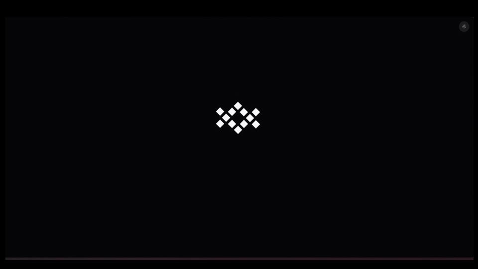](assets/demos/launch-video.mp4)

<sub>↑ 30-second product film generated by `/cinemorph new --from-example launch-cinematic-30s`. Click to play the full MP4.</sub>

[Quick start](#quick-start) · [Commands](#commands) · [How it works](#how-it-works) · [Examples](#bundled-examples) · [GitHub Pages site](https://lucasduys.github.io/cinemorph)

</div>

---

## What is this

Cinemorph is a Claude Code plugin (`/cinemorph`) that composes a Vite + React deck where persistent elements morph cleanly between stages via Framer Motion's shared-layout (`LayoutGroup` + `layoutId`) FLIP transitions. The deck is the artifact: run it live in Chrome, click through with arrow keys, or export to one of three production targets.

| Output | What it produces | When to use |
|---|---|---|
| **Live React deck** | Vite dev server, hot reload, `?dev=1` timeline scrubber | The projector. Pitches, demos, all-hands. |
| **MP4 (Playwright + ffmpeg)** | 30-second to 5-minute cinematic film with audio bus, voiceover, SFX, smear cuts | Launch trailers, social, embeddable on a landing page. |
| **PPTX with native Morph** | Editable PowerPoint with Microsoft Morph transitions between slides | Stakeholder handoff to teams that don't ship from a browser. |

Everything you see in the hero film above is one `stages.ts` + one `data.ts` plus a primitive registry. The composer wrote both files, the scaffold rendered them, Playwright recorded the result, and ffmpeg muxed the audio bed + voiceover + SFX cues.

---

## Quick start

```bash
# 1. Install the plugin into Claude Code
git clone https://github.com/LucasDuys/cinemorph.git
cp -r cinemorph/plugin ~/.claude/plugins/cinemorph

# 2. Restart Claude Code, then in a chat:
/cinemorph new --from-example launch-cinematic-30s --out my-launch-video

# 3. Run it
cd my-launch-video
bun install && bun run dev   # → http://localhost:5173
#                              ?dev=1 for the timeline scrubber
```

Three more things you can do in one command:

```bash
# Investor pitch from a brief
/cinemorph new --theme stacklink-dark --prompt "Series A pitch: problem, solution, traction, team, ask"

# Feature walkthrough from a starter
/cinemorph new --from-example feature-demo --out ./changelog-q2

# Export the active deck to MP4 + PPTX + speaker notes
/cinemorph export --all
```

> **Auth.** Cinemorph spawns the `claude` CLI binary on your `PATH` and uses your Claude Code subscription. No `ANTHROPIC_API_KEY` needed.

---

## What it produces

### A 30-second cinematic launch film

One master RAF clock drives every animation. Phases are non-overlapping windows with 350 ms cross-fade smear cuts at boundaries. The audio bus mixes a music bed, a voiceover, and a curated SFX library. Whooshes ride only real scene transitions; tiles bounce in with `aeBounce` easing.

| `00:01` Logo pop | `00:08` Hyper-zoom + sources | `00:13` "every tool. one brain." |
|:---:|:---:|:---:|
| 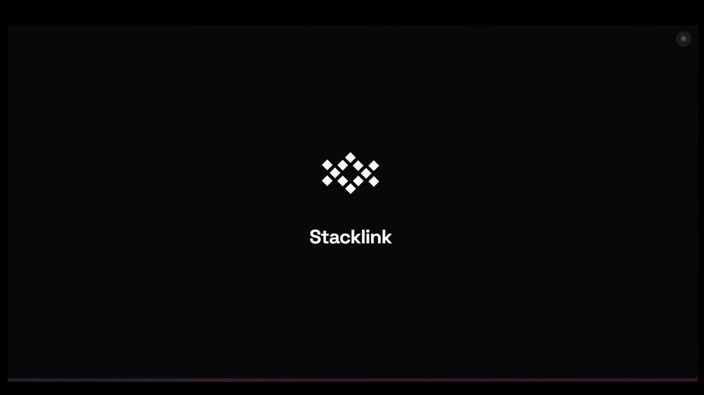 | 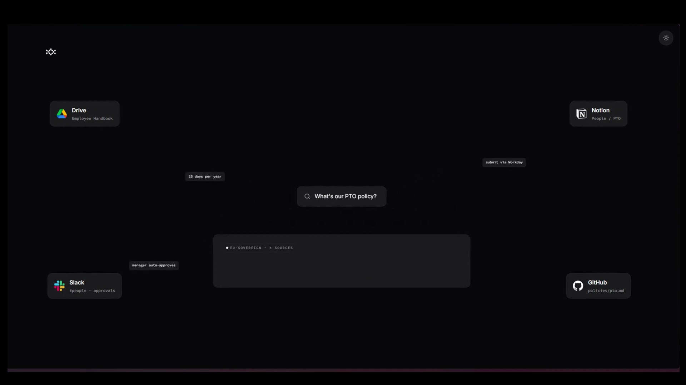 | 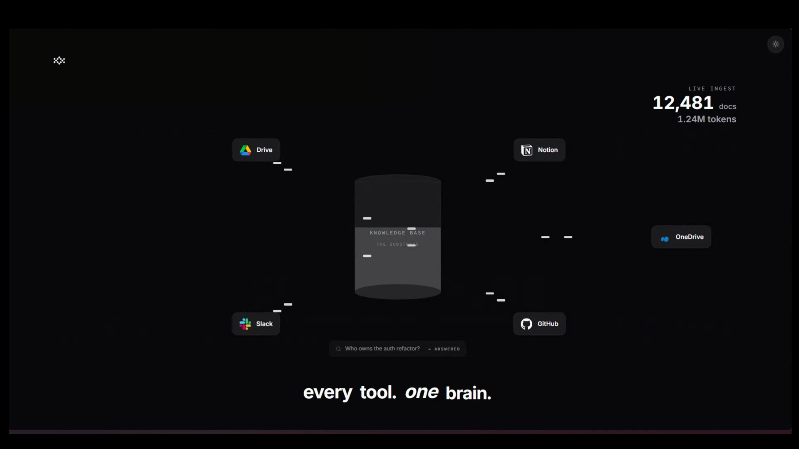 |

| `00:18` Onboarding card lands | `00:22` Agent constellation | `00:28` Outro + URL chime |
|:---:|:---:|:---:|
| 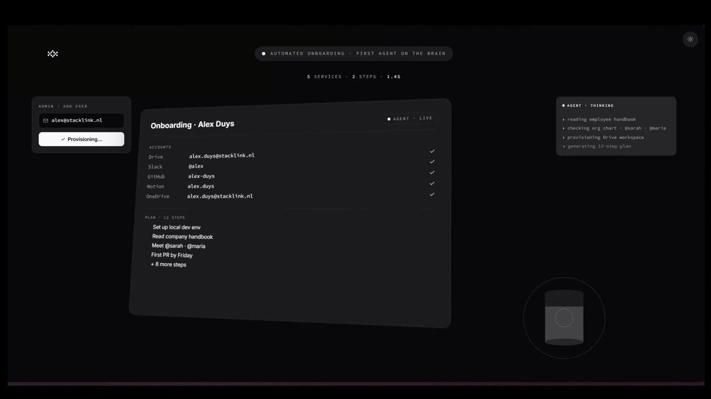 | 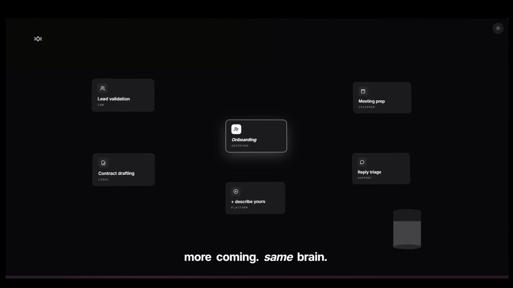 | 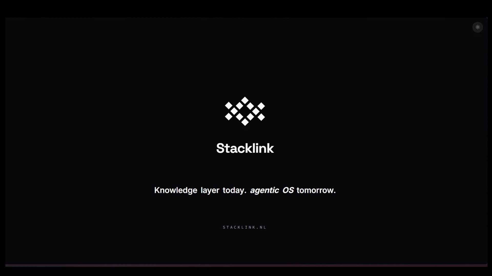 |

[**▶ Watch the full 30s MP4**](assets/demos/launch-video.mp4) (14 MB, 4K source · 3840×2160 @ 30fps)

### A 5-slide investor pitch deck

The `stacklink-roundone-pitch` example renders five click-through stages with shared-layout morphs. Same engine, different example. Bundle is identical: `stages.ts` + `data.ts` + `tokens.ts`.

| 1. Hook | 2. Problem | 3. Solution |
|:---:|:---:|:---:|
| 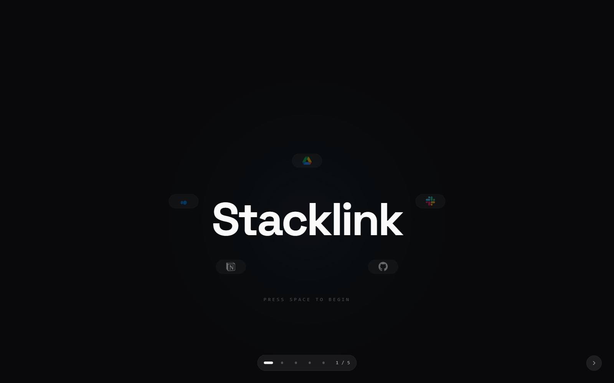 | 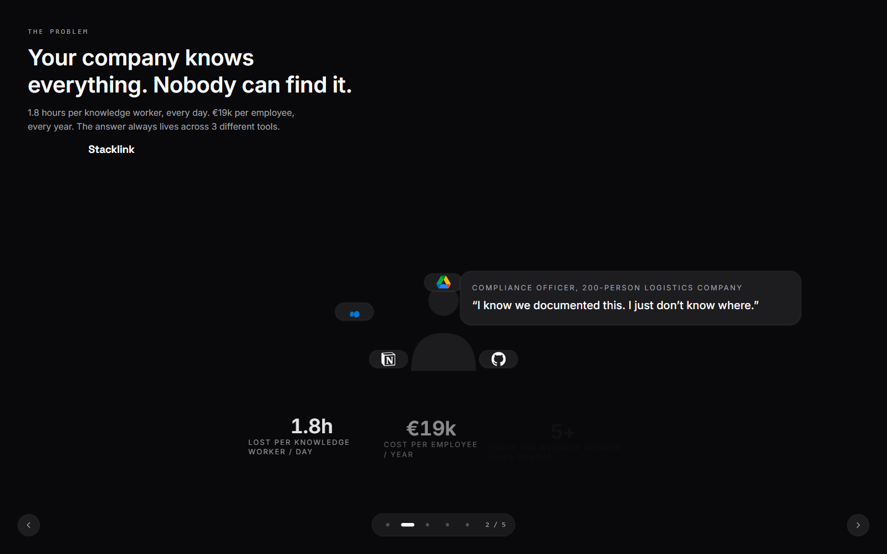 | 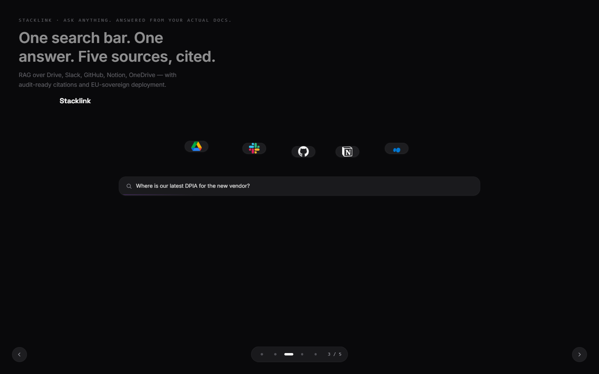 |

| 4. Differentiation | 5. Team & Ask |
|:---:|:---:|
| 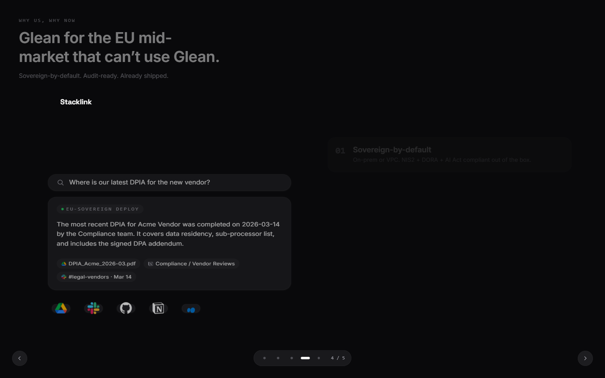 | 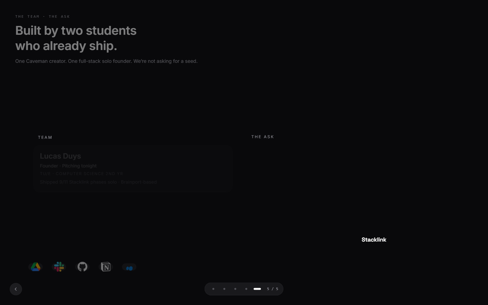 |

---

## Commands

| Command | What it does |
|---|---|
| `/cinemorph new "<brief>" [flags]` | Generate a fresh deck. Asks clarifying questions when inputs are insufficient. |
| `/cinemorph iterate "<change>"` | Modify the active deck (last-touched in cwd or `--deck <path>`). |
| `/cinemorph render` | Open the live deck via `bun run dev`. |
| `/cinemorph pptx` | Export to `dist/<name>.pptx` with native PowerPoint Morph transitions. |
| `/cinemorph video` | Export to `dist/<name>.mp4` via headless Playwright recording + ffmpeg mux. |
| `/cinemorph export --all` | Run pptx + video + `notes.md` in one shot. |
| `/cinemorph reference add <path> --name <name>` | Register an existing deck as a style reference. |

`/morph-deck` continues to work as a v1.0 alias.

### Flags for `/cinemorph new`

```
--from-example <name>      Start from a bundled deck (see Examples)
--theme <name>             stacklink-dark | bunq-mint-light | linear-light | minimal-mono | playful-poster
--tokens <path>            Load tokens.json or DESIGN.md
--reference <image>        Extract a 5-color palette from a screenshot
--prompt "<text>"          Free-form brief or style description
--out <path>               Where to write the new deck (default: ./<slug>)
```

Inputs apply in priority order — `--theme` < `--tokens` < `--reference` < `--prompt`. Later layers win on fields they provide. Missing fields trigger a clarifying question (the composer asks instead of guessing).

---

## How it works

```
brief + flags
     │
     ▼
 ┌───────────────┐
 │ token merger  │  --theme  --tokens  --reference  --prompt   (priority order)
 └──────┬────────┘
        │ tokens.ts
        ▼
 ┌───────────────────────┐
 │ composer (Claude CLI) │  emits stages.ts + data.ts as JSON
 └──────┬────────────────┘
        │
        ▼
 ┌───────────────────────────────────────────┐
 │ scaffold renderer                         │
 │   Vite + React 18 + Tailwind + motion/react│
 └──────┬────────────────────────────────────┘
        │
        ▼
 ┌──────────────────────────────────────────────────────────────┐
 │ live deck   →   PPTX with Morph   →   MP4 (Playwright+ffmpeg) │
 └──────────────────────────────────────────────────────────────┘
```

### The morph engine, in 60 seconds

A `<LayoutGroup>` from `motion/react` wraps every persistent element on the canvas. Each primitive (wordmark, search bar, kpi tile, connector chip, agent card, …) carries a stable `layoutId` across stages. Framer Motion's shared-layout (FLIP) algorithm computes the layout-to-layout delta automatically — no keyframes, no per-property `animate` props, no easing math.

```ts
// stages.ts (excerpt — written by the composer)
export const STAGES: Stage[] = [
  {
    id: 'hook',
    elements: {
      wordmark: { pos: { left: '50%', top: '50%', width: '20%' }, shape: 'wordmark' },
      slack:    { pos: { left: '12%', top: '24%' }, shape: 'connectorChip' },
      drive:    { pos: { left: '88%', top: '24%' }, shape: 'connectorChip' },
    },
  },
  {
    id: 'reveal',
    elements: {
      wordmark: { pos: { left: '50%', top: '14%', width: '12%' }, shape: 'wordmark' },
      slack:    { pos: { left: '20%', top: '60%' }, shape: 'connectorChip' },
      drive:    { pos: { left: '80%', top: '60%' }, shape: 'connectorChip' },
      cylinder: { pos: { left: '50%', top: '50%' }, shape: 'cylinder' },
    },
  },
];
```

When the deck advances from `hook` → `reveal`, the wordmark shrinks and slides to the top. The Slack and Drive chips drift outward and down. The cylinder fades in. All in one synchronized 700 ms transition. No code per element.

### Cinematic-launch-video lessons baked in

For 30-second-style films, the composer enforces the principles in [`plugin/docs/cinematic-launch-video-lessons.md`](plugin/docs/cinematic-launch-video-lessons.md). Every rule there was earned by shipping the hero film above and getting each detail wrong before getting it right:

- **One master RAF clock** writes a single `elapsedMs`. Phases are non-overlapping windows; 350 ms cross-fade smear cuts at boundaries.
- **`aeBounce` easing** for any element that lands with weight (Dan Ebberts' AE bounce ported to TypeScript).
- **Whooshes go on real scene transitions only** — never internal animation events. They lead the visual by 300–500 ms so the sweep + the new scene's snap reads as one cinematic cut.
- **Audio-bus race-condition fix is mandatory.** A `stoppedSfxRef: Set<number>` ensures each cue's `stopAtMs` runs exactly once. Without it, when multiple cues share an audio file via the pool, the first cue's stop check re-fires every frame and pauses every later cue. This was the single most painful bug in the build.
- **Browser autoplay gate** — minimal transparent click area + 64 px play icon. Pre-warm the SFX pool on first interaction.
- **ffmpeg `-ss` seek-mode trap** — input-seek (`-ss` before `-i`) when trimming with `afade`; output-seek can produce silent files that pass duration checks.
- **Volume hierarchy** — music 0.20–0.25 baseline, ducks to 0.05–0.08 under VO; whooshes 0.30–0.40; POPs 0.70–0.80; BLIPs 0.30–0.45 tapered; VO 0.85–0.95.
- **Dev scrubber on `?dev=1`** so a reviewer can give you precise timestamp feedback during iteration.

---

## Bundled examples

Generate any of these with `/cinemorph new --from-example <name>`:

| Example | Description |
|---|---|
| **`launch-cinematic-30s`** | The canonical 30-second film shown above. RAF-clock driven, audio bus wired, dev scrubber, autoplay gate. |
| **`stacklink-roundone-pitch`** | The 5-slide investor pitch shown above. |
| `pitch-5slide` | Generic investor deck (Problem, Solution, Traction, Team, Ask). |
| `feature-demo` | 4–6-slide feature walkthrough. |
| `kpi-dashboard-tour` | Live-data dashboard tour with morphing kpi tiles. |
| `case-study` | Customer success story format. |
| `manifesto` | Vision / principles statement deck. |
| `team-intro` | Team introduction with morphing pillar cards. |
| `release-notes` | Engineering release-notes deck. |
| `roadmap` | Quarterly roadmap with morphing milestone tiles. |
| `retro-storyboard` | Retrospective / post-mortem storyboard. |
| `custom-element` | Reference for adding your own primitive. |

Each example ships its own `README.md`, `brief.md`, `stages.ts`, `data.ts`, and `tokens.ts` — read them as documentation by example.

---

## Customizing the look

Five built-in themes cover most needs:

| Theme | Mood |
|---|---|
| `stacklink-dark` | Near-black canvas, monochromatic, EU-enterprise restraint |
| `bunq-mint-light` | Mint green + white, fintech, modern |
| `linear-light` | Slate + blue, minimal, technical |
| `minimal-mono` | Black + white + grays, typographic, editorial |
| `playful-poster` | Vibrant multi-color, creative, event-driven |

Override with your own tokens:

```bash
/cinemorph new --tokens ./my-tokens.json --prompt "Q1 product all-hands"
```

```jsonc
// my-tokens.json
{
  "background": "#09090F",
  "foreground": "#FAFAFA",
  "mutedForeground": "#A1A1AA",
  "border": "#27272A",
  "fontDisplay": "Space Grotesk, Inter, sans-serif",
  "fontBody": "Inter, sans-serif",
  "fontMono": "JetBrains Mono, monospace"
}
```

Or extract a palette from a brand screenshot:

```bash
/cinemorph new --reference ./brand-screenshot.png --prompt "Series B pitch"
```

---

## Sixteen built-in primitives

`Wordmark` · `KPI` · `Pillar` · `Quote` · `ConnectorChip` (Slack, GitHub, Notion, Linear, Confluence, Jira, OneDrive, Teams, Salesforce, Drive) · `Card` · `Logo` · `Image` · `Diagram` · `Icon` · `Chart` · `MorphChart` · `OrbitGroup` · `PipelineGroup` · `FooterStrip` · `StatGroup`

### Adding your own

Drop a `.tsx` into `src/deck/elements/custom/`:

```tsx
// src/deck/elements/custom/MyChart.tsx — file name auto-derives the id `myChart`
export default function MyChart({ data }: { data: number[] }) { /* ... */ }
```

Use it in `stages.ts`:

```ts
elements: {
  myChart: { pos: { left: '10%', top: '10%', width: '60%', height: '40%' }, shape: 'chart' }
}
```

See [`plugin/examples/custom-element/`](plugin/examples/custom-element/) for the full pattern.

---

## Repository layout

```
cinemorph/
├── plugin/                            # The installed Claude plugin
│   ├── plugin.json                    # Manifest (name, version, entry command)
│   ├── README.md                      # Plugin-internal docs
│   ├── skills/cinemorph/SKILL.md      # Skill definition
│   ├── commands/                      # /cinemorph slash command surfaces
│   ├── agents/morph-composer.md       # Composer system prompt
│   ├── docs/
│   │   ├── cinematic-launch-video-lessons.md   # Canonical reference for video output
│   │   └── composer-live.md
│   ├── examples/                      # 12 starter decks (--from-example sources)
│   ├── scripts/                       # Router, composer harness, exporters, verifier
│   ├── primitives/                    # 16 built-in shape components
│   └── themes/                        # 5 bundled theme JSON files
├── scaffold-template/                 # What `new` clones into your output directory
├── assets/demos/                      # README hero (video, gif, storyboard)
└── site/                              # GitHub Pages source (built into docs/)
```

---

## Testing

```bash
bun test               # all plugin + scaffold tests
bun test plugin        # plugin only
```

Acceptance test against the bundled stacklink reference: `plugin/scripts/__tests__/acceptance-stacklink.test.cjs`.

---

## Inspirations

- The dnyxstudios product-film aesthetic (single-canvas continuous morph, smear cuts, AE inertial overshoot).
- Linear / Arc browser launch films (restrained sans-serif, clicky percussion, 90–110 BPM beds).
- Apple keynote intros (silent open, breath before voice).
- The Y Combinator "company brain" framing (Tom Blomfield, 2026) — the use case that drove the hero film.

---

## License

MIT. See [`LICENSE`](LICENSE).
